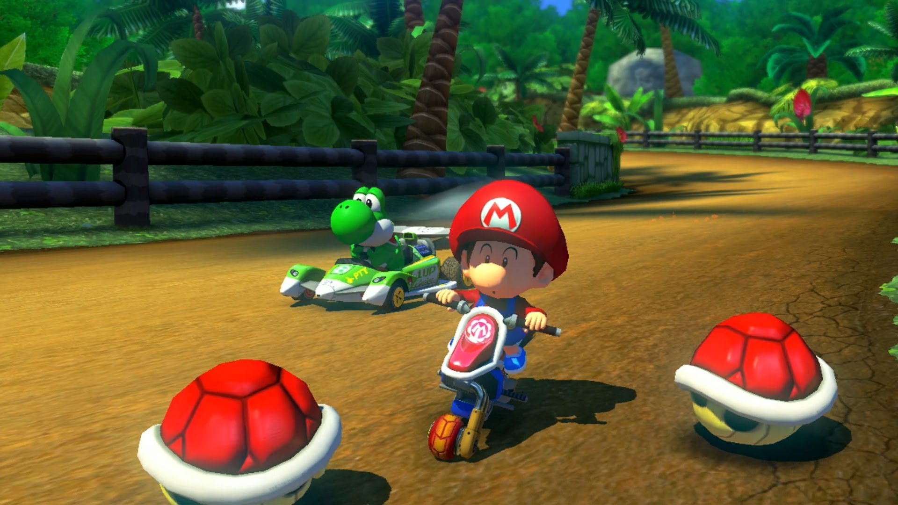

# Stuff Mike did to type the words you're reading

## Getting stuff from Github onto your computer

  1. Install git
  2.  Go to https://github.com/AtlanticR/bioRworkshops (or any git repository of your choosing), and click on the link to "Clone of download".  This should give you a slightly odd address.  Copy it to your clip board.
  3. In a command window, navigate to a folder on your computer that you'd like to contain the repo you identified in the previous step - e.g.

```
c:\Users\mcmahonm>cd c:\git\AtlanticR
c:\git\AtlanticR>
```

  4.  Go to https://github.com/AtlanticR/bioRworkshops, and click on the link to "Clone of download".  This should give you a slightly odd address (i.e. https://github.com/AtlanticR/bioRworkshops.git).  Copy it to your clipboard.
  5. Back in your command window, type the command to clone the workshop.  The following example snippet will copy everything from that repository into the folder you were in  - e.g.
  
  `c:\git\AtlanticR> git clone https://github.com/AtlanticR/bioRworkshops.git`
  
*BAM!* The entire repository gets sucked onto your computer.  At this stage, you can do whatever you want with all of that content.   If you don't want to be a dirty, no-good parasite, you can *contribute* your modifications back to the original source.  

##CLONING OPTION FOR PEOPLE WHO ARE SCARED OF THE SHELL##



1. Install [git](https://git-scm.com/downloads)

2. Install [gitDesktop](https://desktop.github.com/)

3.  Go to the [AtlanticR](https://github.com/AtlanticR/bioRworkshops) github Organization page  (or any git repository of your choosing), and click on the link to "Clone of download".

4. Github desktop will come up and you can select a folder where you would like to store the 'bioRworkshops' repository. **note that you must be logged into both github online and github desktop for this handshake to go through smoothly**. 

*BAM!* The entire repository gets sucked onto your computer and you avoided the shell!  

## Create an R Project (optional)

You don't need R to do any of the stuff so far.  Since this is an R workshop, I've set up my version of the repository as an R Studio Project so that I can use the git tools in R Studio to make modifications and push new content.  If you want tod od the same, follow these steps:

  1) Open R Studio, and select "New Project"
  2) Choose "Existing Directory", and point R Studio to the path of the repository you just cloned.
  3) Voila! - you have a project, and since it's a cloned git project, R Studio knows to make the Git tab available to you.  As you create new folders and files and/or edit existing ones, all of the things you've altered will be shown in the git tab.

## Make your Changes

I feel like the excellent work of Ryan Stanley and Clark Richards would benefit from a moderately humorous description of how to pull content from github, so I'm typing that up right now.  

Since I want to keep my stuff seperate from theirs, I've created a folder I can put my files in.   What you're reading is a markdown file, which is a text file. Since this is an R Noob group, you should know that I'm typing all of this in R Studio.  

If I were to stop right now (with this new folder and my handy file), no one would ever get to read these ingenious words, so the next thing to do is...

## Put stuff up onto Github

In R Studio, putting stuff back to a cloned repo is easy, as long as you are either owner or a "collaborator".  You just:
  1) Select all of the items that you want to put back
  2) Click "Commit", and at the prompt, type your commit message
  3) Click "Push" (and enter your credentials)
  
If you lack the permissions to push changes back, you can always do a "pull request", or "fork" the repository.

That's it!  Now when I go back to https://github.com/AtlanticR/bioRworkshops, I can see my new folder and this handy file.