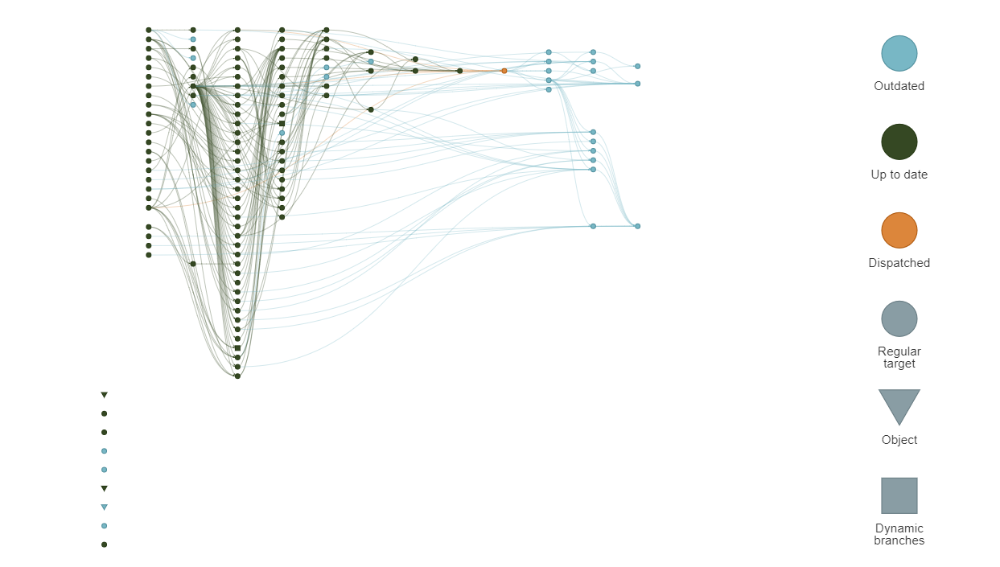

# Overview of targets

The `targets` package helps automate and organize data workflows in R. You break your analysis into steps called targets, and the package keeps track of how each step depends on the others. When something changes, it only reruns the steps that are affected—saving time and avoiding mistakes. In short, it makes your projects faster, more reproducible, and easier to manage.

Scripts for targets are stored in a _target.R file that looks like this:

```{r, echo=FALSE}
library(targets)
```

```{r, eval=FALSE}

tar_option_set()  # default settings

list(
  tar_target(name=x,
             5),
  
  tar_target(name=
               y, 6),
  tar_target(name=
               z, x + y)
)

```


Notice how the targets are set up in a list. Each target is set up using `tar_target`. A target that looks like this:


```{r, eval=FALSE}

 tar_target(name=x,
             5)
```


is the same as saying:


```{r, eval=FALSE}

x <- 5

```

To create the target, we use the `tar_make` function. If you do not specify a `names` argument, all targets (that are outdated) get made by default.

```{r, eval=FALSE}
tar_make(script="_target.R")
```

To view the target pipeline dependency graph with a HTML widget, use `tar_visnetwork`

```{r, eval=FALSE}

tar_visnetwork(script="_target.R")

```


If we then changed x in the original _targets.R file, it would invalidate z, but not y.

```{r, eval=FALSE}
list(
  tar_target(name=x,
             15), # Note the change in x from 5 to 15

  tar_target(name=
               y, 6),
  tar_target(name=
               z, x + y)
)


```


See new target pipeline dependency graph below:

```{r, eval=FALSE}
tar_visnetwork(script="_target.R")
```


To bring everything back up to date, we would use our `tar_make`. See below:


```{r, eval=FALSE}
tar_make(script="_target.R")
tar_visnetwork(script="_target.R")
```


Another tool to visualize your targets is `tar_manifest`. `tar_manifest()` shows you a table of all the targets in your pipeline, including their commands, patterns, and dependencies. It is helpful because it lets you inspect and troubleshoot your workflow without digging through _targets.R. By reviewing the manifest, you can quickly check what each target does, whether a command looks correct, and how targets are connected. In practice, this makes it easier to understand a large pipeline, catch mistakes early, and communicate clearly with teammates about how the workflow is built.


```{r}
tar_manifest(script="_target.R", fields=NULL)
```

# targets In Practice

`targets` makes collaboration easier because everyone shares the same **complex** reproducible workflow, instead of passing around scripts and running steps manually. The pipeline guarantees that each teammate builds the project in the correct order with the same results, simply by running `tar_make()`.

An example of a complex workshop for Marine Conservation is shown below:

```{r, eval=FALSE}
tar_visnetwork(script="inst/_targets.R")
```




Since targets only reruns what has changed, it also reduces compute time for the whole team, avoids “it works on my machine” problems, and keeps the project organized as it grows. An example of large computation time is shown below where `tar_meta()` reads all of the metadata recorded in the target. An example is it gives the seconds each target took to run. In our Marine Conservation work, if we sum up all of the time we get a total of 18 hours from start to finish.


```{r, eval=FALSE}
m <- tar_meta()
sum(m$seconds, na.rm=TRUE)/60/60 # Hours
```


*Note* if you're developing and simply changing the last "end point", like our "z" example up above, it will not take 18 hours every time. That is the whole point of `targets`. It will only run what is needed.

# Caution

**Version Consistency**

To ensure targets produce identical results across machines, the team should use consistent package versions.

**Efficient Storage**

Because targets can cache large results, it’s best to avoid storing very large objects.

**Clean, Well-Organized Code**

Since the order of targets in _targets.R doesn’t enforce execution order, organizing code clearly—using logical grouping, helpers in R/, and thoughtful naming—keeps the pipeline easy to read, maintain, and scale.

**Secure Collaboration**

When working with collaborators, it’s important to avoid hard-coding passwords or credentials in targets or functions

**Helpful Documentation**

Documenting functions and targets (e.g., with roxygen comments) ensures teammates can understand and reuse pipeline components without guesswork, improving long-term maintainability and onboarding.
